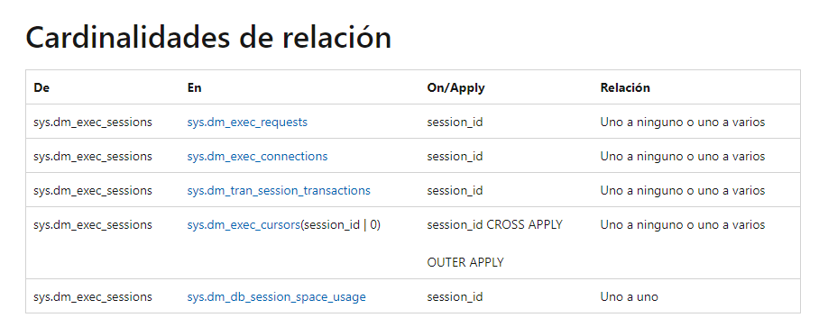

- [Introducción](#introducción)
- [Base teórica](#base-teórica)
- [DMVs necesarias](#dmvs-necesarias)

# Introducción


>Los bloqueos son malos. Llegan cuando menos te los esperas, y cuando los estás esperando, no aparecen. Tiene algo de gato y ratón.

Hay herramientas de sobra para perseguirlos; con un método consistente, seguramente les des caza. El trabajo del DBA es localizarlos, crear las evidencias necesarias, y plantear soluciones.

En este "artículo" te muestro que método puedes para localizarlos y plantear soluciones a los clientes.
 Hay mucha documentación y ejemplos para analizarlos; el objetivo es que te pueda servir como guía de aprendizaje para meter las manos en el barro. Sigue los enlaces que comparto porque se necesitan como "guia de estudio".


# Base teórica

>Es difícil participar en un triatlón si no sabes andar en bicicleta. 

De igual manera, para entender cómo funcionan los bloqueos en SQL Server, necesitas una base teórica. Conceptualmente es sencillo: los SSGG de BBDD están diseñados para atender peticiones de muchos usuarios. Si dos consultas, necesitan cambiar registros, el motor debe garantizar que se cumpla el ACID Test. En relación a transacciones, implementa un "control de concurrencia" para garantizar la I de Isolation (Aislamiento).


En [este enlace](https://medium.com/r/?url=https%3A%2F%2Flearn.microsoft.com%2Fen-us%2Fsql%2Frelational-databases%2Fsql-server-transaction-locking-and-row-versioning-guide%3Fsource%3Drecommendations%26view%3Dsql-server-ver16) tienes toda la base teórica necesaria para comprender los niveles de aislamiento en SQL Server. No es necesario que te estudies el contenido completo (poco a poco); empieza por estas secciones:

- [Transaction basics](https://medium.com/r/?url=https%3A%2F%2Flearn.microsoft.com%2Fen-us%2Fsql%2Frelational-databases%2Fsql-server-transaction-locking-and-row-versioning-guide%3Fsource%3Drecommendations%26view%3Dsql-server-ver16%23Basics): conceptos básicos, ACID, transacciones implícitas y explícitas, contexto, inicio y confirmación (BEGIN/COMMIT TRAN).
- [Locking and row versioning basics](https://medium.com/r/?url=https%3A%2F%2Flearn.microsoft.com%2Fen-us%2Fsql%2Frelational-databases%2Fsql-server-transaction-locking-and-row-versioning-guide%3Fsource%3Drecommendations%26view%3Dsql-server-ver16%23Lock_Basics): cómo se adquieren bloqueos (locks), y efectos de la concurrencia (lecturas sucias, no repetibles, perdida de inserciones, etc.). La segunda parte toca los niveles de aislamiento, y sus efectos en la concurrencia (por ejemplo, qué nivel de aislamiento elegir para que el dato leído en una transacción sea inmutable).
- [Locking in the Database Engine](https://medium.com/r/?url=https%3A%2F%2Flearn.microsoft.com%2Fen-us%2Fsql%2Frelational-databases%2Fsql-server-transaction-locking-and-row-versioning-guide%3Fsource%3Drecommendations%26view%3Dsql-server-ver16%23Lock_Engine): cómo implementa SQL Server los puntos anteriores, es decir, qué tipo de recursos puede bloquear el motor (registro, página, objeto, base de datos) y tipos de bloqueos (compartidos, no compartidos, exclusivos, …).
- [Lock compatibility](https://medium.com/r/?url=https%3A%2F%2Flearn.microsoft.com%2Fen-us%2Fsql%2Frelational-databases%2Fsql-server-transaction-locking-and-row-versioning-guide%3Fsource%3Drecommendations%26view%3Dsql-server-ver16%23lock_compatibility): donde se explica la compatibilidad de bloqueos; por ejemplo, dos conexiones no puede tener asignado bloqueo exclusivo (X) sobre un recurso.

Esas secciones son fundamentales si necesitas entender situaciones de bloqueos. Responde al siguiente ejercicio para ver cómo estas:

Dada una tabla como esta:

```console
create table dbo.tabla ( 
id int identity primary key,
relleno char(100) not null
);
insert into dbo.tabla (relleno)
select name
from sys.all_objects;
```

Ejecutando un borrado como este:

```begin tran;
delete from dbo.tabla
where id = 1;
```
¿Por qué aparece en esta query un bloqueo a nivel de DATABASE:

```
select 
resource_type, resource_database_id, 
request_mode, request_type, request_status
from sys.dm_tran_locks
where request_session_id = 64; -- CAMBIA POR TU SESSION_ID
```


La respuesta está en [DATABASE como resource type](./DATABASE%20como%20resource_type.md)

# DMVs necesarias

Estas son las DMVs que necesitas para analizar cuestiones de bloqueos:
- [sys.dm_tran_locks](https://medium.com/r/?url=https%3A%2F%2Flearn.microsoft.com%2Fen-us%2Fsql%2Frelational-databases%2Fsystem-dynamic-management-views%2Fsys-dm-tran-locks-transact-sql%3Fview%3Dsql-server-ver16): Información de bloqueos adquiridos por las conexiones. Revisa el enlace para entender lo que informa cada columna. Con el tiempo añadirás columnas a tu arsenal, pero para empezar te servirán: resource_type, resource_database_id, request_mode, request_type, request_status, y request_session_id.
- [sys.dm_exec_sessions](https://medium.com/r/?url=https%3A%2F%2Flearn.microsoft.com%2Fes-es%2Fsql%2Frelational-databases%2Fsystem-dynamic-management-views%2Fsys-dm-exec-sessions-transact-sql%3Fview%3Dsql-server-ver16): Información de las conexiones. Quédate con esta relación de tablas:

- [sys.dm_exec_requests](https://medium.com/r/?url=https%3A%2F%2Flearn.microsoft.com%2Fen-us%2Fsql%2Frelational-databases%2Fsystem-dynamic-management-views%2Fsys-dm-exec-requests-transact-sql%3Fview%3Dsql-server-ver16): Información de cada petición que está procesando SQL Server. la columna session_id, se enlaza con request_session_id si hay bloqueos. Columnas de interés: session_id, start_time, status, command, blocking_session_id, database_id, wait_type, wait_time, wait_resource, sql_handle, y plan_handle.
- [sys.dm_exec_connections](https://medium.com/r/?url=https%3A%2F%2Flearn.microsoft.com%2Fen-us%2Fsql%2Frelational-databases%2Fsystem-dynamic-management-views%2Fsys-dm-exec-connections-transact-sql%3Fview%3Dsql-server-ver16): Información de las conexiones abiertas en la instancia de SQL Server. Columnas como session_id, num_read, num_writes, most_recent_sql_handle. Enlaza con sys.dm_exec_requests por la columna session_id.
- [sys.dm_exec_sql_text](https://medium.com/r/?url=https%3A%2F%2Flearn.microsoft.com%2Fen-us%2Fsql%2Frelational-databases%2Fsystem-dynamic-management-views%2Fsys-dm-exec-sql-text-transact-sql%3Fview%3Dsql-server-ver16): Función que devuelve la instrucción SQL para un sql_handle (relacionado con la DMV anterior).

Este JOIN de DMVs te servirá en tus análisis:

```
SELECT 
 blocked.session_id blocked_session_id, 
 blocker.session_id blocker_session_id, 
 req.command,
 req.status, 
 req.start_time,
 req.wait_resource,
 req.wait_time,
 req.wait_resource,
 sql_blocker.text blocker_query_text,
 sql_blocked.text blocked_query_text
FROM    sys.dm_exec_requests req
JOIN    sys.dm_exec_sessions blocked
ON      req.session_id = blocked.session_id
JOIN    sys.dm_exec_sessions blocker
ON      req.blocking_session_id = blocker.session_id
OUTER APPLY sys.dm_exec_sql_text(req.sql_handle) sql_blocked
JOIN    sys.dm_exec_connections c
ON      blocker.session_id = c.session_id
OUTER APPLY sys.dm_exec_sql_text(c.most_recent_sql_handle) sql_blocker
```
donde para una situación de bloqueos, tenemos este resultado:


Que muestra esta situación:

- A la sesión 52, la bloquea la sesión 69.
- A la sesión 69, la bloquea la sesión 67.
- A la sesión 77, la bloquea la sesión 52.

Que sería lo mismo que decir, si la sesión 67 no bloqueara a la 69, la 69 no bloquearía a la 52, que a su vez no bloquearía a la sesión 77.

Revisando los query text, tendríamos que:

- la instrucción: DELETE from dbo.tabla where id = 1;
- no permite ejecutar la instrucción: (@1 tinyint)DELETE [dbo].[tabla] WHERE [id]=@1,
que a su vez no permite ejecutar la instrucción: (@1 tinyint)UPDATE [dbo].[tabla] set [relleno] = NULL WHERE [id]=@1,
- que a su vez no permite ejecutar la instrucción: TRUNCATE table dbo.tabla.

Podemos decir que hemos diagnosticado la situación de bloqueo, pero no tenemos solución; sólo queda esperar... 
Si dos conexiones, intentan borrar la misma fila (como es el caso que he simulado), toca esperar a que la primera conexión que tomó el bloqueo exclusivo (columna wait_resource) sobre el registro (el blocker_session_id = 67) complete lo que está haciendo.

